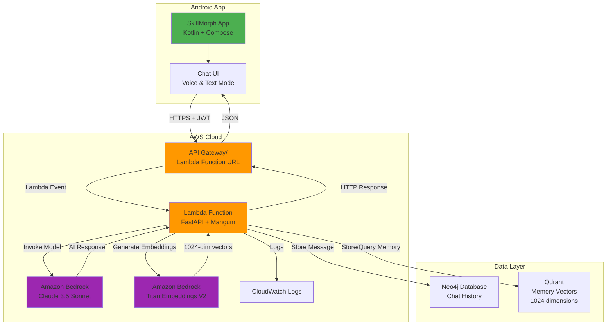
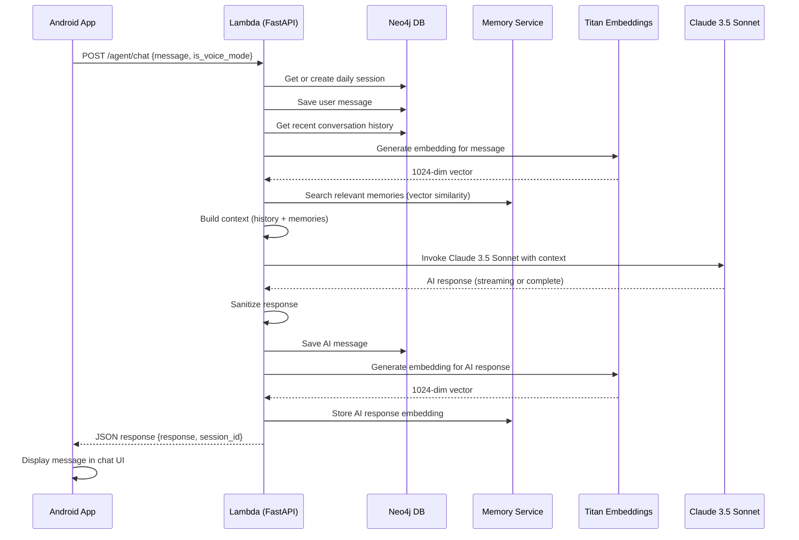

# Design Document: Amazon Bedrock Integration with Claude 3.5 Sonnet & Titan Embeddings

## Overview

This design document describes the integration of Amazon Bedrock with Claude 3.5 Sonnet (for chat/reasoning) and Amazon Titan Embeddings V2 (for semantic search/memory) into the SkillMorph Lambda backend. This integration replaces the existing Google Gemini/LangChain implementation with AWS-native AI services, providing superior reasoning capabilities and integrated embeddings for memory retrieval.

### Why Amazon Bedrock with Claude 3.5 Sonnet?

**Model Characteristics:**
- ✅ Industry-leading reasoning and coding capabilities
- ✅ 200K token context window (excellent for long conversations)
- ✅ Serverless deployment (no infrastructure management)
- ✅ Superior instruction following and structured output
- ✅ Supports text and image input, text output
- ✅ Best-in-class performance for complex tasks, coding, and analysis

### Why Amazon Titan Embeddings V2?

**Embeddings Characteristics:**
- ✅ Native AWS service (no external dependencies)
- ✅ 1024-dimensional embeddings (optimal for semantic search)
- ✅ Cost-effective ($0.0001 per 1K tokens)
- ✅ Fast inference and low latency
- ✅ Optimized for RAG and memory retrieval
- ✅ Seamless integration with Qdrant vector database

**Integration Benefits:**
- ✅ Native AWS service (better Lambda integration)
- ✅ No external API keys needed (uses IAM roles)
- ✅ Automatic scaling and availability
- ✅ Built-in monitoring via CloudWatch
- ✅ Pay-per-use pricing (no minimum commitments)
- ✅ Unified embeddings + chat solution

### What You'll Do Manually (AWS Console Setup)
- Verify Bedrock model access (auto-enabled on first use)
- Update Lambda IAM role with Bedrock permissions
- Configure model settings and quotas
- Test model access via AWS Console

### What Kiro Will Do (Code Implementation)
- Replace LangChain/Gemini with Bedrock SDK
- Implement Claude 3.5 Sonnet chat integration (200K context window)
- Implement Titan Embeddings V2 for memory/semantic search
- Add error handling and retry logic
- Update chat API Lambda function
- Integrate embeddings with Qdrant vector database
- Implement streaming responses (optional)
- Add response caching for cost optimization


## Architecture

### High-Level System Architecture



### Request Flow for Chat




## Manual Setup Instructions (What YOU Do)

### Prerequisites

1. **AWS Account**: Active AWS account with Lambda already deployed
2. **Lambda Function**: SkillMorph Lambda function running (from Mangum deployment)
3. **IAM Access**: Permissions to modify IAM roles and enable Bedrock models
4. **AWS CLI**: Configured and working (from previous setup)

### Step 1: Understand Bedrock Model Access (5 minutes)

**Good News**: AWS has simplified model access! Models are now automatically enabled on first use.

**How It Works:**
- Serverless foundation models (Claude, Titan, etc.) are automatically enabled when first invoked
- No manual activation needed through the "Model access" page
- Models become available account-wide after first invocation
- For Anthropic models (Claude), first-time users may need to submit use case details

**What You Need to Do:**
1. **For Claude 3.5 Sonnet** (first-time Anthropic users):
   - Navigate to Bedrock Console → Model catalog
   - Find "Claude 3.5 Sonnet v2" (Model ID: `anthropic.claude-3-5-sonnet-20241022-v2:0`)
   - Click "Open in playground"
   - If prompted, submit use case details (usually instant approval)
   - Test the model with a simple prompt

2. **For Amazon Titan Embeddings V2**:
   - No action needed - automatically enabled on first API call
   - Model ID: `amazon.titan-embed-text-v2:0`

3. **Verify Access** (optional):
   - Go to Bedrock Console → Playgrounds → Chat
   - Select "Claude 3.5 Sonnet v2" from dropdown
   - Send a test message
   - If it works, you're all set!

**Important Notes:**
- Model access is per-region (invoke in the region where your Lambda runs)
- Access is account-wide (all IAM users/roles can use it once enabled)
- No cost for enabling access (you only pay for usage)
- IAM policies still control who can invoke models


### Step 2: Update Lambda IAM Role with Bedrock Permissions (15 minutes)

Your Lambda function needs permission to invoke Bedrock models.

1. **Navigate to IAM Console**:
   - Go to AWS Console → Services → IAM
   - Click "Roles" in left sidebar
   - Find your Lambda role: `SkillMorphLambdaRole` (or whatever you named it)

2. **Add Bedrock Permissions**:
   - Click on the role name
   - Click "Add permissions" → "Create inline policy"
   - Click "JSON" tab

3. **Add This Policy**:
   ```json
   {
     "Version": "2012-10-17",
     "Statement": [
       {
         "Sid": "BedrockInvokeModel",
         "Effect": "Allow",
         "Action": [
           "bedrock:InvokeModel",
           "bedrock:InvokeModelWithResponseStream"
         ],
         "Resource": [
           "arn:aws:bedrock:*::foundation-model/anthropic.claude-3-5-sonnet-20241022-v2:0",
           "arn:aws:bedrock:*::foundation-model/amazon.titan-embed-text-v2:0"
         ]
       }
     ]
   }
   ```

4. **Name and Create**:
   - Policy name: `BedrockInvokePolicy`
   - Description: "Allows Lambda to invoke Bedrock Claude 3.5 Sonnet and Titan Embeddings V2"
   - Click "Create policy"

5. **Verify Permissions**:
   - Go back to role summary
   - You should see the new inline policy listed
   - Verify it shows "bedrock:InvokeModel" action

**Alternative: Use AWS Managed Policy (Broader Access)**

If you want to allow access to all Bedrock models (easier for experimentation):

1. Instead of inline policy, click "Add permissions" → "Attach policies"
2. Search for: `AmazonBedrockFullAccess`
3. Check the box and click "Add permissions"

**Note**: The inline policy above is more restrictive (only Claude 3.5 Sonnet and Titan Embeddings), which is better for production security.


### Step 3: Configure Model Settings and Quotas (10 minutes)

1. **Check Service Quotas**:
   - Go to AWS Console → Service Quotas
   - Search for "Bedrock"
   - Check quotas for:
     - "Claude 3.5 Sonnet - Requests per minute": Default is usually 100-200
     - "Claude 3.5 Sonnet - Tokens per minute": Default is usually 200K-400K
     - "Titan Embeddings V2 - Requests per minute": Default is usually 1000+

2. **Request Quota Increase (if needed)**:
   - For hackathon/MVP: Default quotas are usually sufficient
   - For production: Click "Request quota increase" if you need more
   - Typical approval time: 24-48 hours

3. **Set Up CloudWatch Alarms (optional but recommended)**:
   - Go to CloudWatch → Alarms
   - Create alarm for Bedrock throttling:
     - Metric: `AWS/Bedrock` → `ModelInvocationThrottles`
     - Threshold: > 10 in 5 minutes
     - Action: Send SNS notification to your email

### Step 4: Test Bedrock Access (10 minutes)

Test that everything is configured correctly before Kiro implements the code.

1. **Test Claude 3.5 Sonnet via AWS CLI**:
   ```bash
   aws bedrock-runtime invoke-model \
     --model-id anthropic.claude-3-5-sonnet-20241022-v2:0 \
     --body '{"anthropic_version":"bedrock-2023-05-31","max_tokens":100,"messages":[{"role":"user","content":"Hello"}]}' \
     --region us-east-1 \
     output.json
   
   cat output.json
   ```

2. **Test Titan Embeddings via AWS CLI**:
   ```bash
   aws bedrock-runtime invoke-model \
     --model-id amazon.titan-embed-text-v2:0 \
     --body '{"inputText":"Hello world","dimensions":1024,"normalize":true}' \
     --region us-east-1 \
     embeddings-output.json
   
   cat embeddings-output.json
   ```

3. **Expected Responses**:
   - Claude: Should see JSON with "content" array containing generated text
   - Titan: Should see JSON with "embedding" array of 1024 floats
   - If you get "AccessDeniedException": Check IAM permissions
   - If you get "ValidationException": Check request format
   - If you get "ResourceNotFoundException": Enable model access (Step 1)

4. **Test via Bedrock Console (easier)**:
   - Go to Bedrock Console → Playgrounds → Chat
   - Select "Claude 3.5 Sonnet" from model dropdown
   - Type a test message: "Hello, introduce yourself"
   - Click "Run"
   - Should see AI response

5. **Note Model Details**:
   - Chat Model ID: `anthropic.claude-3-5-sonnet-20241022-v2:0`
   - Embeddings Model ID: `amazon.titan-embed-text-v2:0`
   - Region: (where you enabled it, e.g., `us-east-1`)
   - Max tokens (Claude): 8192 (output limit)
   - Context window (Claude): 200K tokens (input + output)
   - Embedding dimensions: 1024


### Step 5: Update Lambda Environment Variables (5 minutes)

Add configuration for Bedrock to your Lambda function.

1. **Navigate to Lambda Console**:
   - Go to Lambda → Functions
   - Select your function: `skillmorph-api`

2. **Add Environment Variables**:
   - Go to "Configuration" tab → "Environment variables"
   - Click "Edit"
   - Add these variables:
     - Key: `BEDROCK_CHAT_MODEL_ID`, Value: `anthropic.claude-3-5-sonnet-20241022-v2:0`
     - Key: `BEDROCK_EMBEDDING_MODEL_ID`, Value: `amazon.titan-embed-text-v2:0`
     - Key: `BEDROCK_REGION`, Value: `us-east-1` (or your region)
     - Key: `USE_BEDROCK`, Value: `true`
     - Key: `MAX_TOKENS`, Value: `4096` (adjust based on needs)
     - Key: `TEMPERATURE`, Value: `0.7` (0.0-1.0, higher = more creative)
     - Key: `EMBEDDING_DIMENSIONS`, Value: `1024`
   - Click "Save"

3. **Verify Configuration**:
   - Environment variables should now show in the list
   - Lambda will automatically restart with new config

### Summary of What You Created

✅ Bedrock Model Access: Claude 3.5 Sonnet and Titan Embeddings V2 (auto-enabled on first use)  
✅ IAM Permissions: Lambda can invoke both Bedrock models  
✅ Service Quotas: Checked and sufficient  
✅ Test Successful: Both models respond correctly  
✅ Environment Variables: Lambda configured for Bedrock  

**Important Values to Save**:
- Chat Model ID: `anthropic.claude-3-5-sonnet-20241022-v2:0`
- Embeddings Model ID: `amazon.titan-embed-text-v2:0`
- Region: `us-east-1` (or your region)
- IAM Role ARN: `arn:aws:iam::____________:role/SkillMorphLambdaRole`
- Embedding Dimensions: 1024

You're now ready for Kiro to implement the Bedrock integration code!


## Code Implementation (What KIRO Does)

### Project Structure Updates

```
backend/
├── app/
│   ├── services/
│   │   ├── llm_service.py          # UPDATED: Add Bedrock support
│   │   ├── bedrock_service.py      # NEW: Claude 3.5 Sonnet client wrapper
│   │   ├── titan_embeddings.py     # NEW: Titan Embeddings V2 service
│   │   └── ...
│   ├── agent/
│   │   ├── graph.py                # UPDATED: Use Bedrock instead of Gemini
│   │   └── ...
│   └── main.py                     # UPDATED: Add Bedrock health check
├── requirements.txt                # UPDATED: Add boto3
└── ...
```

### Key Implementation Files

#### 1. Bedrock Service Wrapper (`app/services/bedrock_service.py`)

This is the core service that wraps the AWS Bedrock SDK for Claude 3.5 Sonnet.

```python
"""
Amazon Bedrock Service for SkillMorph - Claude 3.5 Sonnet

Provides a clean interface to Amazon Bedrock's Claude 3.5 Sonnet model.
Handles conversation context, error handling, and retry logic.
Uses Anthropic's Messages API format.
"""

import os
import json
import time
from typing import List, Dict, Any, Optional
import boto3
from botocore.exceptions import ClientError

class BedrockService:
    """Service for interacting with Amazon Bedrock Claude 3.5 Sonnet model"""
    
    def __init__(self):
        self.model_id = os.getenv("BEDROCK_CHAT_MODEL_ID", "anthropic.claude-3-5-sonnet-20241022-v2:0")
        self.region = os.getenv("BEDROCK_REGION", "us-east-1")
        self.max_tokens = int(os.getenv("MAX_TOKENS", "4096"))
        self.temperature = float(os.getenv("TEMPERATURE", "0.7"))
        
        # Initialize Bedrock client
        self.client = boto3.client(
            service_name="bedrock-runtime",
            region_name=self.region
        )
        
        print(f"✅ Bedrock Service initialized: {self.model_id} in {self.region}")
    
    def generate_response(
        self,
        prompt: str,
        system_prompt: Optional[str] = None,
        conversation_history: Optional[List[Dict[str, str]]] = None,
        max_tokens: Optional[int] = None,
        temperature: Optional[float] = None
    ) -> str:
        """
        Generate a response from Bedrock Claude 3.5 Sonnet
        
        Args:
            prompt: User's message
            system_prompt: System instructions for the model
            conversation_history: List of previous messages [{"role": "user"|"assistant", "content": "..."}]
            max_tokens: Override default max tokens
            temperature: Override default temperature
            
        Returns:
            Generated text response
        """
        try:
            # Build messages array for Claude
            messages = self._build_messages(
                prompt=prompt,
                conversation_history=conversation_history
            )
            
            # Prepare request body for Claude 3.5 Sonnet (Anthropic Messages API)
            request_body = {
                "anthropic_version": "bedrock-2023-05-31",
                "max_tokens": max_tokens or self.max_tokens,
                "messages": messages,
                "temperature": temperature or self.temperature,
                "top_p": 0.9
            }
            
            # Add system prompt if provided
            if system_prompt:
                request_body["system"] = system_prompt
            
            # Invoke model with retry logic
            response = self._invoke_with_retry(request_body)
            
            # Extract generated text
            generated_text = self._extract_response(response)
            
            return generated_text
            
        except Exception as e:
            print(f"❌ Bedrock generation error: {e}")
            raise
    
    def _build_messages(
        self,
        prompt: str,
        conversation_history: Optional[List[Dict[str, str]]] = None
    ) -> List[Dict[str, Any]]:
        """
        Build messages array for Claude's Messages API
        
        Claude uses a messages array format:
        [
            {"role": "user", "content": "Hello"},
            {"role": "assistant", "content": "Hi there!"},
            {"role": "user", "content": "How are you?"}
        ]
        """
        messages = []
        
        # Add conversation history
        if conversation_history:
            for msg in conversation_history[-10:]:  # Keep last 10 messages for context
                messages.append({
                    "role": msg["role"],  # "user" or "assistant"
                    "content": msg["content"]
                })
        
        # Add current prompt
        messages.append({
            "role": "user",
            "content": prompt
        })
        
        return messages
    
    def _invoke_with_retry(
        self,
        request_body: Dict[str, Any],
        max_retries: int = 3
    ) -> Dict[str, Any]:
        """
        Invoke Bedrock model with exponential backoff retry logic
        
        Handles throttling and transient errors gracefully.
        """
        for attempt in range(max_retries):
            try:
                response = self.client.invoke_model(
                    modelId=self.model_id,
                    body=json.dumps(request_body),
                    contentType="application/json",
                    accept="application/json"
                )
                
                # Parse response
                response_body = json.loads(response["body"].read())
                return response_body
                
            except ClientError as e:
                error_code = e.response["Error"]["Code"]
                
                # Handle throttling with exponential backoff
                if error_code == "ThrottlingException" and attempt < max_retries - 1:
                    wait_time = (2 ** attempt) + (0.1 * attempt)  # Exponential backoff
                    print(f"⚠️ Throttled by Bedrock, retrying in {wait_time}s...")
                    time.sleep(wait_time)
                    continue
                
                # Handle other errors
                print(f"❌ Bedrock ClientError: {error_code} - {e}")
                raise
                
            except Exception as e:
                print(f"❌ Unexpected error invoking Bedrock: {e}")
                raise
        
        raise Exception(f"Failed to invoke Bedrock after {max_retries} retries")
    
    def _extract_response(self, response_body: Dict[str, Any]) -> str:
        """
        Extract generated text from Claude's response
        
        Claude 3.5 Sonnet response format:
        {
            "id": "msg_...",
            "type": "message",
            "role": "assistant",
            "content": [
                {
                    "type": "text",
                    "text": "Generated response here"
                }
            ],
            "stop_reason": "end_turn" | "max_tokens"
        }
        """
        try:
            content_blocks = response_body.get("content", [])
            
            # Extract text from content blocks
            generated_text = ""
            for block in content_blocks:
                if block.get("type") == "text":
                    generated_text += block.get("text", "")
            
            # Check if response was truncated
            stop_reason = response_body.get("stop_reason")
            if stop_reason == "max_tokens":
                print("⚠️ Response truncated due to max_tokens limit")
            
            return generated_text.strip()
            
        except Exception as e:
            print(f"❌ Error extracting response: {e}")
            return "I apologize, but I encountered an error generating a response."
    
    def generate_streaming_response(
        self,
        prompt: str,
        system_prompt: Optional[str] = None,
        conversation_history: Optional[List[Dict[str, str]]] = None
    ):
        """
        Generate a streaming response from Bedrock (for real-time chat)
        
        Yields chunks of text as they're generated.
        """
        try:
            messages = self._build_messages(prompt, conversation_history)
            
            request_body = {
                "anthropic_version": "bedrock-2023-05-31",
                "max_tokens": self.max_tokens,
                "messages": messages,
                "temperature": self.temperature,
                "top_p": 0.9
            }
            
            if system_prompt:
                request_body["system"] = system_prompt
            
            # Invoke with streaming
            response = self.client.invoke_model_with_response_stream(
                modelId=self.model_id,
                body=json.dumps(request_body),
                contentType="application/json",
                accept="application/json"
            )
            
            # Stream chunks
            for event in response["body"]:
                chunk = json.loads(event["chunk"]["bytes"])
                
                # Claude streaming format
                if chunk.get("type") == "content_block_delta":
                    delta = chunk.get("delta", {})
                    if delta.get("type") == "text_delta":
                        yield delta.get("text", "")
                        
        except Exception as e:
            print(f"❌ Streaming error: {e}")
            yield "Error generating response."

# Global instance
bedrock_service = BedrockService()
```


#### 2. Titan Embeddings Service (`app/services/titan_embeddings.py`)

This service handles text embeddings generation using Amazon Titan Embeddings V2.

```python
"""
Amazon Titan Embeddings V2 Service for SkillMorph

Provides text embedding generation for semantic search and memory retrieval.
Generates 1024-dimensional embeddings optimized for Qdrant vector database.
"""

import os
import json
from typing import List, Optional
import boto3
from botocore.exceptions import ClientError
import numpy as np

class TitanEmbeddingsService:
    """Service for generating embeddings with Amazon Titan Embeddings V2"""
    
    def __init__(self):
        self.model_id = os.getenv("BEDROCK_EMBEDDING_MODEL_ID", "amazon.titan-embed-text-v2:0")
        self.region = os.getenv("BEDROCK_REGION", "us-east-1")
        self.dimensions = int(os.getenv("EMBEDDING_DIMENSIONS", "1024"))
        
        # Initialize Bedrock client
        self.client = boto3.client(
            service_name="bedrock-runtime",
            region_name=self.region
        )
        
        print(f"✅ Titan Embeddings Service initialized: {self.model_id} ({self.dimensions}D)")
    
    def generate_embedding(
        self,
        text: str,
        normalize: bool = True
    ) -> List[float]:
        """
        Generate embedding vector for a single text
        
        Args:
            text: Text to embed
            normalize: Whether to normalize the embedding vector
            
        Returns:
            List of floats representing the embedding (1024 dimensions)
        """
        try:
            # Prepare request body for Titan Embeddings V2
            request_body = {
                "inputText": text,
                "dimensions": self.dimensions,
                "normalize": normalize
            }
            
            # Invoke model
            response = self.client.invoke_model(
                modelId=self.model_id,
                body=json.dumps(request_body),
                contentType="application/json",
                accept="application/json"
            )
            
            # Parse response
            response_body = json.loads(response["body"].read())
            embedding = response_body.get("embedding", [])
            
            if len(embedding) != self.dimensions:
                print(f"⚠️ Warning: Expected {self.dimensions}D embedding, got {len(embedding)}D")
            
            return embedding
            
        except ClientError as e:
            error_code = e.response["Error"]["Code"]
            print(f"❌ Titan Embeddings ClientError: {error_code} - {e}")
            raise
            
        except Exception as e:
            print(f"❌ Error generating embedding: {e}")
            raise
    
    def generate_embeddings_batch(
        self,
        texts: List[str],
        normalize: bool = True
    ) -> List[List[float]]:
        """
        Generate embeddings for multiple texts
        
        Args:
            texts: List of texts to embed
            normalize: Whether to normalize the embedding vectors
            
        Returns:
            List of embedding vectors
        """
        embeddings = []
        
        for text in texts:
            try:
                embedding = self.generate_embedding(text, normalize)
                embeddings.append(embedding)
            except Exception as e:
                print(f"⚠️ Failed to embed text: {text[:50]}... Error: {e}")
                # Return zero vector on error
                embeddings.append([0.0] * self.dimensions)
        
        return embeddings
    
    def compute_similarity(
        self,
        embedding1: List[float],
        embedding2: List[float]
    ) -> float:
        """
        Compute cosine similarity between two embeddings
        
        Args:
            embedding1: First embedding vector
            embedding2: Second embedding vector
            
        Returns:
            Cosine similarity score (0.0 to 1.0)
        """
        try:
            # Convert to numpy arrays
            vec1 = np.array(embedding1)
            vec2 = np.array(embedding2)
            
            # Compute cosine similarity
            dot_product = np.dot(vec1, vec2)
            norm1 = np.linalg.norm(vec1)
            norm2 = np.linalg.norm(vec2)
            
            if norm1 == 0 or norm2 == 0:
                return 0.0
            
            similarity = dot_product / (norm1 * norm2)
            
            # Clamp to [0, 1] range
            return max(0.0, min(1.0, similarity))
            
        except Exception as e:
            print(f"❌ Error computing similarity: {e}")
            return 0.0
    
    def embed_for_storage(self, text: str) -> dict:
        """
        Generate embedding and prepare for storage in Qdrant
        
        Args:
            text: Text to embed
            
        Returns:
            Dict with text and embedding ready for Qdrant storage
        """
        embedding = self.generate_embedding(text, normalize=True)
        
        return {
            "text": text,
            "embedding": embedding,
            "dimensions": len(embedding)
        }

# Global instance
titan_embeddings = TitanEmbeddingsService()
```


#### 3. Updated LLM Service (`app/services/llm_service.py`)

Update the existing LLM service to use Bedrock instead of Gemini.

```python
"""
LLM Service - Updated to use Amazon Bedrock

Provides high-level AI functions for SkillMorph features.
"""

import os
from typing import Dict, List, Any
from app.services.bedrock_service import bedrock_service

class LLMService:
    """High-level LLM service using Amazon Bedrock"""
    
    def __init__(self):
        self.use_bedrock = os.getenv("USE_BEDROCK", "true").lower() == "true"
        print(f"✅ LLM Service initialized (Bedrock: {self.use_bedrock})")
    
    def generate_day_topic(self, goal_title: str, day_number: int) -> Dict[str, Any]:
        """
        Generate learning content for a specific day in a goal roadmap
        
        Args:
            goal_title: The learning goal (e.g., "Learn Python")
            day_number: Which day in the roadmap (1-30)
            
        Returns:
            {"topic": "...", "sub_tasks": ["...", "...", "..."]}
        """
        system_prompt = """You are an expert learning coach creating daily learning plans.
Generate a focused topic and 3-5 actionable subtasks for the given day.
Keep topics progressive and building on previous days.
Format your response as JSON: {"topic": "...", "sub_tasks": ["...", "...", "..."]}"""
        
        prompt = f"""Goal: {goal_title}
Day: {day_number}

Generate today's learning topic and subtasks."""
        
        try:
            response = bedrock_service.generate_response(
                prompt=prompt,
                system_prompt=system_prompt,
                max_tokens=500,
                temperature=0.7
            )
            
            # Parse JSON response
            import json
            content = self._extract_json(response)
            
            return {
                "topic": content.get("topic", f"Day {day_number} Learning"),
                "sub_tasks": content.get("sub_tasks", [
                    "Review previous concepts",
                    "Practice exercises",
                    "Build a small project"
                ])
            }
            
        except Exception as e:
            print(f"❌ Error generating day topic: {e}")
            return {
                "topic": f"Day {day_number}: {goal_title}",
                "sub_tasks": [
                    "Review learning materials",
                    "Complete practice exercises",
                    "Apply concepts to a project"
                ]
            }
    
    def generate_learning_resources(
        self,
        goal_title: str,
        category: str = ""
    ) -> List[Dict[str, str]]:
        """
        Generate learning resource recommendations
        
        Returns:
            [{"title": "...", "type": "video|article|course", "url": "...", "description": "..."}]
        """
        system_prompt = """You are a learning resource curator.
Recommend 5 high-quality learning resources for the given goal.
Include a mix of videos, articles, and courses.
Format as JSON array: [{"title": "...", "type": "video|article|course", "url": "...", "description": "..."}]"""
        
        prompt = f"""Goal: {goal_title}
Category: {category}

Recommend 5 learning resources."""
        
        try:
            response = bedrock_service.generate_response(
                prompt=prompt,
                system_prompt=system_prompt,
                max_tokens=1000,
                temperature=0.7
            )
            
            import json
            resources = self._extract_json(response)
            
            if isinstance(resources, list):
                return resources[:5]  # Limit to 5
            
            return []
            
        except Exception as e:
            print(f"❌ Error generating resources: {e}")
            return []
    
    def generate_chat_response(
        self,
        user_message: str,
        conversation_history: List[Dict[str, str]],
        user_context: Dict[str, Any],
        is_voice_mode: bool = False
    ) -> str:
        """
        Generate a chat response with full context
        
        Args:
            user_message: Current user message
            conversation_history: Previous messages
            user_context: User profile, goals, memories
            is_voice_mode: Whether to optimize for voice output
            
        Returns:
            AI response text
        """
        # Build system prompt with user context
        system_prompt = self._build_chat_system_prompt(user_context, is_voice_mode)
        
        try:
            response = bedrock_service.generate_response(
                prompt=user_message,
                system_prompt=system_prompt,
                conversation_history=conversation_history,
                max_tokens=1024,
                temperature=0.8
            )
            
            return response
            
        except Exception as e:
            print(f"❌ Error generating chat response: {e}")
            return "I apologize, but I'm having trouble generating a response right now. Please try again."
    
    def _build_chat_system_prompt(
        self,
        user_context: Dict[str, Any],
        is_voice_mode: bool
    ) -> str:
        """Build system prompt with user context"""
        
        base_prompt = """You are SkillMorph AI, a friendly and knowledgeable learning assistant.
You help users achieve their learning goals through personalized guidance and support.

Your personality:
- Encouraging and supportive
- Clear and concise
- Practical and actionable
- Enthusiastic about learning"""
        
        if is_voice_mode:
            base_prompt += "\n\nIMPORTANT: Keep responses brief and conversational for voice output (2-3 sentences max)."
        
        # Add user context
        if user_context.get("current_goals"):
            goals = ", ".join(user_context["current_goals"])
            base_prompt += f"\n\nUser's current goals: {goals}"
        
        if user_context.get("recent_memories"):
            memories = "\n".join(user_context["recent_memories"][:3])
            base_prompt += f"\n\nRelevant context:\n{memories}"
        
        return base_prompt
    
    def _extract_json(self, text: str) -> Any:
        """Extract JSON from text response"""
        import json
        import re
        
        # Try to find JSON in the response
        json_match = re.search(r'\{.*\}|\[.*\]', text, re.DOTALL)
        if json_match:
            try:
                return json.loads(json_match.group())
            except:
                pass
        
        # If no JSON found, return empty
        return {}

# Global instance
llm_service = LLMService()
```


#### 3. Updated Agent Graph (`app/agent/graph.py`)

Update the LangGraph agent to use Bedrock instead of Gemini.

```python
"""
Agent Graph - Updated to use Amazon Bedrock

Defines the conversational agent workflow using LangGraph.
"""

from typing import TypedDict, Annotated, Sequence
from langchain_core.messages import BaseMessage, HumanMessage, AIMessage
from langgraph.graph import StateGraph, END
from langgraph.checkpoint.memory import MemorySaver
from app.services.bedrock_service import bedrock_service
from app.services.memory_service import memory_service
from app.services.graph_crud import get_user_profile_stats

# Define agent state
class AgentState(TypedDict):
    messages: Annotated[Sequence[BaseMessage], "The conversation messages"]
    is_voice_mode: bool
    user_id: str

def call_bedrock_model(state: AgentState) -> AgentState:
    """
    Call Bedrock model with conversation context
    
    This is the main agent node that generates responses.
    """
    messages = state["messages"]
    is_voice_mode = state.get("is_voice_mode", False)
    user_id = state.get("user_id", "unknown")
    
    # Get last user message
    last_message = messages[-1].content if messages else ""
    
    # Build conversation history for Bedrock
    conversation_history = []
    for msg in messages[:-1]:  # Exclude last message (it's the prompt)
        role = "user" if isinstance(msg, HumanMessage) else "assistant"
        conversation_history.append({
            "role": role,
            "content": msg.content
        })
    
    # Get user context
    user_context = _get_user_context(user_id, last_message)
    
    # Build system prompt
    system_prompt = _build_system_prompt(user_context, is_voice_mode)
    
    # Generate response
    try:
        response_text = bedrock_service.generate_response(
            prompt=last_message,
            system_prompt=system_prompt,
            conversation_history=conversation_history,
            max_tokens=1024 if not is_voice_mode else 256,
            temperature=0.8
        )
        
        # Create AI message
        ai_message = AIMessage(content=response_text)
        
        return {
            "messages": messages + [ai_message],
            "is_voice_mode": is_voice_mode,
            "user_id": user_id
        }
        
    except Exception as e:
        print(f"❌ Bedrock error in agent: {e}")
        error_message = AIMessage(
            content="I apologize, but I'm having trouble right now. Please try again in a moment."
        )
        return {
            "messages": messages + [error_message],
            "is_voice_mode": is_voice_mode,
            "user_id": user_id
        }

def _get_user_context(user_id: str, query: str) -> dict:
    """Get relevant user context for the conversation"""
    context = {}
    
    try:
        # Get user profile stats
        profile = get_user_profile_stats(user_id)
        context["total_goals"] = profile.get("total_goals", 0)
        context["active_goals"] = profile.get("active_goals", 0)
        
        # Get relevant memories
        memories = memory_service.search_memory(query, user_id=user_id, top_k=3)
        context["recent_memories"] = [m["text"] for m in memories]
        
    except Exception as e:
        print(f"⚠️ Error getting user context: {e}")
    
    return context

def _build_system_prompt(user_context: dict, is_voice_mode: bool) -> str:
    """Build system prompt with user context"""
    
    prompt = """You are SkillMorph AI, a friendly and knowledgeable learning assistant.
You help users achieve their learning goals through personalized guidance and support.

Your personality:
- Encouraging and supportive
- Clear and concise
- Practical and actionable
- Enthusiastic about learning

Guidelines:
- Provide specific, actionable advice
- Reference the user's goals when relevant
- Be conversational and warm
- Ask clarifying questions when needed"""
    
    if is_voice_mode:
        prompt += "\n\nIMPORTANT: Keep responses brief for voice (2-3 sentences max)."
    
    # Add user stats
    if user_context.get("active_goals", 0) > 0:
        prompt += f"\n\nUser has {user_context['active_goals']} active learning goals."
    
    # Add relevant memories
    if user_context.get("recent_memories"):
        memories = "\n".join(user_context["recent_memories"])
        prompt += f"\n\nRelevant context from past conversations:\n{memories}"
    
    return prompt

# Build the graph
workflow = StateGraph(AgentState)

# Add nodes
workflow.add_node("bedrock_agent", call_bedrock_model)

# Set entry point
workflow.set_entry_point("bedrock_agent")

# Add edge to end
workflow.add_edge("bedrock_agent", END)

# Compile with memory
memory = MemorySaver()
agent_app = workflow.compile(checkpointer=memory)
```


#### 4. Updated Requirements (`requirements.txt`)

Add boto3 for AWS SDK support:

```txt
# Existing dependencies
uvicorn==0.40.0
fastapi==0.128.0
python-multipart
langchain_core==1.2.7
langgraph==1.0.6
neo4j==6.1.0
protobuf==5.29.5
pydantic==2.12.5
pydantic_settings==2.12.0
numpy<2.0.0
qdrant_client==1.16.2
mangum==0.17.0

# NEW: AWS SDK for Bedrock
boto3==1.35.0
botocore==1.35.0
```

#### 5. Updated Main App (`app/main.py`)

Add Bedrock health check endpoint:

```python
# Add this endpoint to app/main.py

@app.get("/health/bedrock")
def bedrock_health_check():
    """
    Check if Bedrock is accessible and configured correctly
    """
    try:
        from app.services.bedrock_service import bedrock_service
        
        # Try a simple generation
        response = bedrock_service.generate_response(
            prompt="Say 'OK' if you can hear me.",
            max_tokens=10,
            temperature=0.1
        )
        
        return {
            "status": "healthy",
            "model_id": bedrock_service.model_id,
            "region": bedrock_service.region,
            "test_response": response[:50]  # First 50 chars
        }
        
    except Exception as e:
        return {
            "status": "unhealthy",
            "error": str(e)
        }
```


#### 6. Conversation Context Management

Implement smart context window management for the 200K token limit:

```python
"""
Context Manager for Bedrock Conversations

Manages the 200K token context window efficiently for Claude 3.5 Sonnet.
"""

from typing import List, Dict
import tiktoken  # For token counting

class ConversationContextManager:
    """Manages conversation context within Bedrock's 200K token limit"""
    
    def __init__(self, max_context_tokens: int = 190000):
        """
        Args:
            max_context_tokens: Maximum tokens to use (leave buffer for response)
        """
        self.max_context_tokens = max_context_tokens
        # Use cl100k_base encoding (similar to Claude, good approximation)
        self.encoding = tiktoken.get_encoding("cl100k_base")
    
    def prepare_context(
        self,
        current_message: str,
        conversation_history: List[Dict[str, str]],
        system_prompt: str,
        memories: List[str] = None
    ) -> tuple[str, List[Dict[str, str]]]:
        """
        Prepare context that fits within token limit
        
        Returns:
            (system_prompt, trimmed_conversation_history)
        """
        # Count tokens for each component
        system_tokens = self._count_tokens(system_prompt)
        current_tokens = self._count_tokens(current_message)
        memory_tokens = sum(self._count_tokens(m) for m in (memories or []))
        
        # Reserve tokens for response (8K)
        available_tokens = self.max_context_tokens - system_tokens - current_tokens - memory_tokens - 8000
        
        # Trim conversation history to fit
        trimmed_history = self._trim_history(conversation_history, available_tokens)
        
        # Add memories to system prompt if they fit
        if memories and memory_tokens < 10000:  # Allow more memory context with 200K window
            memory_context = "\n\nRelevant memories:\n" + "\n".join(memories)
            system_prompt += memory_context
        
        return system_prompt, trimmed_history
    
    def _count_tokens(self, text: str) -> int:
        """Count tokens in text"""
        try:
            return len(self.encoding.encode(text))
        except:
            # Fallback: rough estimate (1 token ≈ 4 chars)
            return len(text) // 4
    
    def _trim_history(
        self,
        history: List[Dict[str, str]],
        max_tokens: int
    ) -> List[Dict[str, str]]:
        """
        Trim conversation history to fit within token limit
        
        Strategy: Keep most recent messages, always keep first message
        """
        if not history:
            return []
        
        # Always keep first message (context setting)
        first_message = history[0]
        remaining_history = history[1:]
        
        # Count tokens from most recent backwards
        trimmed = []
        current_tokens = self._count_tokens(first_message["content"])
        
        for msg in reversed(remaining_history):
            msg_tokens = self._count_tokens(msg["content"])
            if current_tokens + msg_tokens <= max_tokens:
                trimmed.insert(0, msg)
                current_tokens += msg_tokens
            else:
                break
        
        # Add first message back
        return [first_message] + trimmed

# Global instance
context_manager = ConversationContextManager()
```

Update `bedrock_service.py` to use context manager:

```python
# Add to BedrockService class

from app.services.context_manager import context_manager

def generate_response(
    self,
    prompt: str,
    system_prompt: Optional[str] = None,
    conversation_history: Optional[List[Dict[str, str]]] = None,
    memories: Optional[List[str]] = None,
    max_tokens: Optional[int] = None,
    temperature: Optional[float] = None
) -> str:
    """Generate response with smart context management"""
    
    # Prepare context within token limits
    prepared_system, prepared_history = context_manager.prepare_context(
        current_message=prompt,
        conversation_history=conversation_history or [],
        system_prompt=system_prompt or "",
        memories=memories
    )
    
    # Build prompt with prepared context
    full_prompt = self._build_prompt(
        prompt=prompt,
        system_prompt=prepared_system,
        conversation_history=prepared_history
    )
    
    # ... rest of generation logic
```


#### 7. Error Handling and Retry Logic

Comprehensive error handling for production reliability:

```python
"""
Bedrock Error Handler

Provides robust error handling and retry logic for Bedrock API calls.
"""

import time
from typing import Callable, Any
from functools import wraps
from botocore.exceptions import ClientError

class BedrockErrorHandler:
    """Handles Bedrock-specific errors with appropriate retry strategies"""
    
    # Error codes that should trigger retries
    RETRYABLE_ERRORS = {
        "ThrottlingException",
        "ServiceUnavailableException",
        "InternalServerException",
        "TooManyRequestsException"
    }
    
    # Error codes that should NOT retry
    NON_RETRYABLE_ERRORS = {
        "ValidationException",
        "AccessDeniedException",
        "ResourceNotFoundException",
        "ModelNotReadyException"
    }
    
    @staticmethod
    def with_retry(max_retries: int = 3, base_delay: float = 1.0):
        """
        Decorator for automatic retry with exponential backoff
        
        Usage:
            @BedrockErrorHandler.with_retry(max_retries=3)
            def my_bedrock_call():
                ...
        """
        def decorator(func: Callable) -> Callable:
            @wraps(func)
            def wrapper(*args, **kwargs) -> Any:
                last_exception = None
                
                for attempt in range(max_retries):
                    try:
                        return func(*args, **kwargs)
                        
                    except ClientError as e:
                        error_code = e.response["Error"]["Code"]
                        last_exception = e
                        
                        # Don't retry non-retryable errors
                        if error_code in BedrockErrorHandler.NON_RETRYABLE_ERRORS:
                            print(f"❌ Non-retryable Bedrock error: {error_code}")
                            raise
                        
                        # Retry with exponential backoff
                        if error_code in BedrockErrorHandler.RETRYABLE_ERRORS:
                            if attempt < max_retries - 1:
                                wait_time = base_delay * (2 ** attempt)
                                print(f"⚠️ Bedrock {error_code}, retry {attempt + 1}/{max_retries} in {wait_time}s")
                                time.sleep(wait_time)
                                continue
                        
                        # Unknown error, retry anyway
                        if attempt < max_retries - 1:
                            wait_time = base_delay * (2 ** attempt)
                            print(f"⚠️ Unknown Bedrock error, retrying in {wait_time}s")
                            time.sleep(wait_time)
                            continue
                        
                        raise
                    
                    except Exception as e:
                        last_exception = e
                        print(f"❌ Unexpected error: {e}")
                        
                        if attempt < max_retries - 1:
                            wait_time = base_delay * (2 ** attempt)
                            print(f"⚠️ Retrying in {wait_time}s")
                            time.sleep(wait_time)
                            continue
                        
                        raise
                
                # All retries exhausted
                raise last_exception
            
            return wrapper
        return decorator
    
    @staticmethod
    def handle_error(error: Exception) -> str:
        """
        Convert Bedrock errors to user-friendly messages
        
        Returns:
            User-friendly error message
        """
        if isinstance(error, ClientError):
            error_code = error.response["Error"]["Code"]
            
            error_messages = {
                "ThrottlingException": "I'm receiving too many requests right now. Please try again in a moment.",
                "ServiceUnavailableException": "The AI service is temporarily unavailable. Please try again shortly.",
                "ValidationException": "There was an issue with your request. Please try rephrasing your message.",
                "AccessDeniedException": "I don't have permission to access the AI model. Please contact support.",
                "ResourceNotFoundException": "The AI model is not available. Please contact support.",
                "ModelNotReadyException": "The AI model is still loading. Please try again in a minute.",
                "TooManyRequestsException": "Too many requests. Please wait a moment before trying again."
            }
            
            return error_messages.get(
                error_code,
                "I encountered an unexpected error. Please try again."
            )
        
        return "I'm having trouble right now. Please try again in a moment."

# Usage in BedrockService
class BedrockService:
    # ... existing code ...
    
    @BedrockErrorHandler.with_retry(max_retries=3, base_delay=1.0)
    def _invoke_model_with_retry(self, request_body: Dict[str, Any]) -> Dict[str, Any]:
        """Invoke model with automatic retry"""
        response = self.client.invoke_model(
            modelId=self.model_id,
            body=json.dumps(request_body),
            contentType="application/json",
            accept="application/json"
        )
        
        return json.loads(response["body"].read())
    
    def generate_response(self, prompt: str, **kwargs) -> str:
        """Generate response with error handling"""
        try:
            # ... preparation code ...
            
            response = self._invoke_model_with_retry(request_body)
            return self._extract_response(response)
            
        except Exception as e:
            print(f"❌ Bedrock error: {e}")
            return BedrockErrorHandler.handle_error(e)
```


## Android App Updates

### Minimal Changes Required

The Android app doesn't need significant changes since the API contract remains the same. However, you may want to add some UI improvements for better user experience.

### Optional: Add Streaming Support

If you implement streaming responses in the backend, update the Android client:

#### 1. Update API Service (`SkillMorphApiService.kt`)

```kotlin
interface SkillMorphApiService {
    // Existing non-streaming endpoint
    @POST("agent/chat")
    suspend fun sendMessage(
        @Header("x-user-id") userId: String,
        @Body request: ChatRequest
    ): Response<ChatResponse>
    
    // NEW: Streaming endpoint (optional)
    @POST("agent/chat/stream")
    @Streaming
    suspend fun sendMessageStreaming(
        @Header("x-user-id") userId: String,
        @Body request: ChatRequest
    ): Response<ResponseBody>
}
```

#### 2. Handle Streaming in ViewModel (Optional)

```kotlin
class AgentViewModel @Inject constructor(
    private val apiService: SkillMorphApiService
) : ViewModel() {
    
    fun sendMessageWithStreaming(message: String) {
        viewModelScope.launch {
            try {
                val response = apiService.sendMessageStreaming(
                    userId = currentUserId,
                    request = ChatRequest(message = message)
                )
                
                if (response.isSuccessful) {
                    response.body()?.let { body ->
                        // Read streaming response
                        body.source().use { source ->
                            val buffer = Buffer()
                            while (!source.exhausted()) {
                                source.read(buffer, 8192)
                                val chunk = buffer.readUtf8()
                                // Update UI with chunk
                                _streamingText.value += chunk
                            }
                        }
                    }
                }
            } catch (e: Exception) {
                Log.e("AgentViewModel", "Streaming error", e)
            }
        }
    }
}
```

### No Other Changes Needed

The existing Android app will work with Bedrock without modifications because:
- API endpoints remain the same (`/agent/chat`)
- Request/response format unchanged
- Authentication flow unchanged
- Error handling remains the same


## Testing Strategy

### Local Testing (Before Deployment)

1. **Mock Bedrock for Local Development**:

```python
# app/services/bedrock_service.py

class MockBedrockService:
    """Mock Bedrock service for local testing"""
    
    def generate_response(self, prompt: str, **kwargs) -> str:
        return f"[MOCK] Response to: {prompt[:50]}..."
    
    def generate_streaming_response(self, prompt: str, **kwargs):
        yield "[MOCK] Streaming response..."

# Use mock when running locally
if os.getenv("ENVIRONMENT") == "local":
    bedrock_service = MockBedrockService()
else:
    bedrock_service = BedrockService()
```

2. **Test with Docker Locally**:

```bash
# Build and run locally
docker build -t skillmorph-api:test .

docker run -p 9000:8080 \
    -e USE_BEDROCK=true \
    -e BEDROCK_MODEL_ID=google.gemma-3-12b-it \
    -e BEDROCK_REGION=us-east-1 \
    -e AWS_ACCESS_KEY_ID=your-key \
    -e AWS_SECRET_ACCESS_KEY=your-secret \
    skillmorph-api:test

# Test health check
curl -XPOST "http://localhost:9000/2015-03-31/functions/function/invocations" \
  -d '{"httpMethod":"GET","path":"/health/bedrock","headers":{}}'
```

### Lambda Testing

1. **Test Bedrock Health Endpoint**:

```bash
# After deployment
curl https://your-lambda-url.lambda-url.us-east-1.on.aws/health/bedrock
```

Expected response:
```json
{
  "status": "healthy",
  "model_id": "google.gemma-3-12b-it",
  "region": "us-east-1",
  "test_response": "OK"
}
```

2. **Test Chat Endpoint**:

```bash
curl -X POST https://your-lambda-url.lambda-url.us-east-1.on.aws/agent/chat \
  -H "Content-Type: application/json" \
  -H "x-user-id: test_user_123" \
  -d '{
    "message": "Hello, can you help me learn Python?",
    "is_voice_mode": false,
    "session_id": "test_session"
  }'
```

Expected response:
```json
{
  "response": "Hello! I'd be happy to help you learn Python...",
  "mode": "text",
  "session_id": "test_session"
}
```

### Android App Testing

1. **Test Chat Functionality**:
   - Open chat screen
   - Send message: "Hello"
   - Verify AI responds
   - Check response time (should be < 3 seconds)

2. **Test Voice Mode**:
   - Enable voice mode
   - Send message
   - Verify response is brief (2-3 sentences)

3. **Test Error Handling**:
   - Disable internet
   - Send message
   - Verify error message displays
   - Re-enable internet
   - Verify retry works

4. **Test Context Retention**:
   - Send: "My name is John"
   - Send: "What's my name?"
   - Verify AI remembers: "Your name is John"

### Load Testing (Optional)

Test Bedrock performance under load:

```python
# load_test.py
import asyncio
import aiohttp
import time

async def send_request(session, url, user_id):
    async with session.post(
        url,
        json={"message": "Hello", "is_voice_mode": False},
        headers={"x-user-id": user_id}
    ) as response:
        return await response.json()

async def load_test(url, num_requests=100):
    start = time.time()
    
    async with aiohttp.ClientSession() as session:
        tasks = [
            send_request(session, url, f"user_{i}")
            for i in range(num_requests)
        ]
        results = await asyncio.gather(*tasks, return_exceptions=True)
    
    duration = time.time() - start
    errors = sum(1 for r in results if isinstance(r, Exception))
    
    print(f"Completed {num_requests} requests in {duration:.2f}s")
    print(f"Errors: {errors}")
    print(f"Avg response time: {duration/num_requests:.2f}s")

# Run
asyncio.run(load_test("https://your-lambda-url/agent/chat", num_requests=50))
```

### Monitoring in Production

1. **CloudWatch Metrics to Monitor**:
   - Lambda invocations
   - Lambda errors
   - Lambda duration
   - Bedrock invocations (custom metric)
   - Bedrock throttles (custom metric)

2. **Set Up CloudWatch Alarms**:

```bash
# Create alarm for high error rate
aws cloudwatch put-metric-alarm \
  --alarm-name skillmorph-bedrock-errors \
  --alarm-description "Alert on Bedrock errors" \
  --metric-name Errors \
  --namespace AWS/Lambda \
  --statistic Sum \
  --period 300 \
  --threshold 10 \
  --comparison-operator GreaterThanThreshold \
  --evaluation-periods 1
```

3. **Custom Logging**:

```python
# Add to bedrock_service.py
import json
from datetime import datetime

def log_bedrock_call(prompt: str, response: str, duration: float, error: str = None):
    """Log Bedrock calls for monitoring"""
    log_entry = {
        "timestamp": datetime.utcnow().isoformat(),
        "model_id": "google.gemma-3-12b-it",
        "prompt_length": len(prompt),
        "response_length": len(response) if response else 0,
        "duration_ms": duration * 1000,
        "error": error
    }
    print(f"BEDROCK_CALL: {json.dumps(log_entry)}")
```


## Cost Estimation and Optimization

### Claude 3.5 Sonnet Pricing

**Input Pricing:**
- $0.003 per 1K input tokens

**Output Pricing:**
- $0.015 per 1K output tokens

### Titan Embeddings V2 Pricing

**Embedding Generation:**
- $0.0001 per 1K input tokens
- Extremely cost-effective for memory/semantic search

### Example Usage Calculations

**Scenario 1: Light Usage (Hackathon/MVP)**
- 1,000 chat messages per month
- Average 500 input tokens per message (conversation context)
- Average 200 output tokens per response
- 1,000 embedding generations (for memory storage)

**Cost:**
- Chat Input: 1,000 × 500 tokens × $0.003 / 1,000 = $1.50
- Chat Output: 1,000 × 200 tokens × $0.015 / 1,000 = $3.00
- Embeddings: 1,000 × 200 tokens × $0.0001 / 1,000 = $0.02
- **Total: $4.52/month**

**Scenario 2: Moderate Usage (Active Development)**
- 10,000 chat messages per month
- Average 800 input tokens (longer conversations)
- Average 300 output tokens
- 10,000 embedding generations

**Cost:**
- Chat Input: 10,000 × 800 × $0.003 / 1,000 = $24.00
- Chat Output: 10,000 × 300 × $0.015 / 1,000 = $45.00
- Embeddings: 10,000 × 300 × $0.0001 / 1,000 = $0.30
- **Total: $69.30/month**

**Scenario 3: Production Usage**
- 100,000 chat messages per month
- Average 1000 input tokens
- Average 400 output tokens
- 100,000 embedding generations

**Cost:**
- Chat Input: 100,000 × 1000 × $0.003 / 1,000 = $300.00
- Chat Output: 100,000 × 400 × $0.015 / 1,000 = $600.00
- Embeddings: 100,000 × 400 × $0.0001 / 1,000 = $4.00
- **Total: $904.00/month**

### Cost Optimization Strategies

#### 1. Response Caching

Cache common responses to reduce API calls:

```python
from functools import lru_cache
import hashlib

class BedrockCache:
    """Simple in-memory cache for Bedrock responses"""
    
    def __init__(self, max_size: int = 1000):
        self.cache = {}
        self.max_size = max_size
    
    def get_cache_key(self, prompt: str, system_prompt: str) -> str:
        """Generate cache key from prompts"""
        combined = f"{system_prompt}|{prompt}"
        return hashlib.md5(combined.encode()).hexdigest()
    
    def get(self, prompt: str, system_prompt: str) -> Optional[str]:
        """Get cached response"""
        key = self.get_cache_key(prompt, system_prompt)
        return self.cache.get(key)
    
    def set(self, prompt: str, system_prompt: str, response: str):
        """Cache response"""
        if len(self.cache) >= self.max_size:
            # Remove oldest entry
            self.cache.pop(next(iter(self.cache)))
        
        key = self.get_cache_key(prompt, system_prompt)
        self.cache[key] = response

# Usage in BedrockService
cache = BedrockCache()

def generate_response(self, prompt: str, system_prompt: str = None, **kwargs) -> str:
    # Check cache first
    cached = cache.get(prompt, system_prompt or "")
    if cached:
        print("✅ Cache hit!")
        return cached
    
    # Generate new response
    response = self._generate_new_response(prompt, system_prompt, **kwargs)
    
    # Cache it
    cache.set(prompt, system_prompt or "", response)
    
    return response
```

#### 2. Reduce Context Window

Only include necessary conversation history:

```python
def prepare_minimal_context(
    conversation_history: List[Dict[str, str]],
    max_messages: int = 5
) -> List[Dict[str, str]]:
    """Keep only recent messages to reduce input tokens"""
    
    # Always keep first message (sets context)
    if len(conversation_history) <= max_messages:
        return conversation_history
    
    return [conversation_history[0]] + conversation_history[-(max_messages-1):]
```

#### 3. Optimize System Prompts

Keep system prompts concise:

```python
# ❌ Verbose (wastes tokens)
system_prompt = """
You are SkillMorph AI, a highly advanced artificial intelligence learning assistant
designed to help users achieve their educational and professional development goals
through personalized guidance, support, and encouragement. You should always be
friendly, supportive, clear, concise, practical, actionable, and enthusiastic about
learning and personal growth.
"""

# ✅ Concise (saves tokens)
system_prompt = """
You are SkillMorph AI, a friendly learning assistant.
Be supportive, clear, and actionable.
"""
```

#### 4. Batch Processing

For non-interactive tasks (like daily briefings), batch multiple requests:

```python
async def generate_daily_briefings_batch(user_ids: List[str]):
    """Generate briefings for multiple users efficiently"""
    
    # Process in parallel with rate limiting
    semaphore = asyncio.Semaphore(5)  # Max 5 concurrent requests
    
    async def generate_one(user_id: str):
        async with semaphore:
            return await generate_briefing(user_id)
    
    results = await asyncio.gather(*[generate_one(uid) for uid in user_ids])
    return results
```

#### 5. Use Shorter Responses for Voice Mode

Voice mode should use fewer tokens:

```python
if is_voice_mode:
    max_tokens = 100  # Brief response
    system_prompt += "\nKeep response under 2 sentences."
else:
    max_tokens = 1024  # Detailed response
```

### Cost Monitoring

Add custom CloudWatch metrics to track costs:

```python
import boto3

cloudwatch = boto3.client('cloudwatch')

def log_bedrock_usage(input_tokens: int, output_tokens: int):
    """Log token usage to CloudWatch for cost tracking"""
    
    cloudwatch.put_metric_data(
        Namespace='SkillMorph/Bedrock',
        MetricData=[
            {
                'MetricName': 'InputTokens',
                'Value': input_tokens,
                'Unit': 'Count'
            },
            {
                'MetricName': 'OutputTokens',
                'Value': output_tokens,
                'Unit': 'Count'
            },
            {
                'MetricName': 'EstimatedCost',
                'Value': (input_tokens * 0.00015 / 1000) + (output_tokens * 0.00020 / 1000),
                'Unit': 'None'
            }
        ]
    )
```

### Expected Monthly Costs Summary

| Usage Level | Messages/Month | Chat Cost | Embeddings Cost | Total Cost |
|-------------|----------------|-----------|-----------------|------------|
| Hackathon   | 1,000          | $4.50     | $0.02           | $4.52      |
| MVP         | 10,000         | $69.00    | $0.30           | $69.30     |
| Production  | 100,000        | $900.00   | $4.00           | $904.00    |

**Plus Lambda costs:**
- Lambda: ~$0.00 - $5.00 (mostly free tier)
- API Gateway: ~$0.01 - $1.00
- CloudWatch Logs: ~$0.05 - $0.50

**Total estimated monthly cost:**
- Hackathon: **$4.50 - $6.00**
- MVP: **$69.00 - $75.00**
- Production: **$900.00 - $920.00**

**Note**: Claude 3.5 Sonnet provides superior reasoning and coding capabilities compared to smaller models, making it ideal for complex tasks and production applications where quality matters.


## Troubleshooting Guide

### Issue: "AccessDeniedException" when calling Bedrock

**Cause**: Lambda IAM role doesn't have Bedrock permissions

**Solution**:
1. Go to IAM Console → Roles → SkillMorphLambdaRole
2. Verify `BedrockInvokePolicy` is attached
3. Check policy has correct model ARN: `arn:aws:bedrock:*::foundation-model/google.gemma-3-12b-it`
4. Verify model access is enabled in Bedrock Console

### Issue: "ResourceNotFoundException: Could not find model"

**Cause**: Model access not enabled or wrong model ID

**Solution**:
1. Go to Bedrock Console → Model access
2. Verify "Claude 3.5 Sonnet" and "Titan Embeddings V2" show "Access granted"
3. Check model IDs are exactly:
   - Chat: `anthropic.claude-3-5-sonnet-20241022-v2:0` (case-sensitive)
   - Embeddings: `amazon.titan-embed-text-v2:0` (case-sensitive)
4. Verify you're in the correct AWS region

### Issue: "ThrottlingException: Rate exceeded"

**Cause**: Too many requests to Bedrock

**Solution**:
1. Check Service Quotas for Claude 3.5 Sonnet and Titan Embeddings
2. Implement request queuing:
```python
import asyncio
from asyncio import Semaphore

# Limit concurrent Bedrock calls
bedrock_semaphore = Semaphore(5)

async def generate_with_limit(prompt: str):
    async with bedrock_semaphore:
        return await bedrock_service.generate_response(prompt)
```
3. Request quota increase in Service Quotas console

### Issue: Responses are slow (> 5 seconds)

**Cause**: Large context window or cold start

**Solution**:
1. Reduce conversation history (keep last 5 messages only)
2. Shorten system prompts
3. Reduce max_tokens for faster responses
4. Consider provisioned concurrency for Lambda
5. Use streaming responses for better UX

### Issue: Responses are cut off mid-sentence

**Cause**: max_tokens limit reached

**Solution**:
1. Increase max_tokens in environment variables
2. Check Bedrock response for `stop_reason: "max_tokens"`
3. Adjust based on use case:
   - Voice mode: 100-200 tokens
   - Chat mode: 500-1024 tokens
   - Long-form: 2048-4096 tokens

### Issue: "ValidationException: Invalid request body"

**Cause**: Incorrect request format for Claude 3.5 Sonnet

**Solution**:
1. Verify request body format (Anthropic Messages API):
```json
{
  "anthropic_version": "bedrock-2023-05-31",
  "max_tokens": 4096,
  "messages": [
    {
      "role": "user",
      "content": "Hello"
    }
  ],
  "system": "You are a helpful assistant",
  "temperature": 0.7,
  "top_p": 0.9
}
```
2. Check messages array format (must alternate user/assistant)
3. Verify all parameters are correct types (numbers, not strings)
4. Ensure system prompt is separate from messages array

### Issue: High costs / unexpected charges

**Cause**: Too many tokens being used

**Solution**:
1. Check CloudWatch metrics for token usage
2. Implement response caching (see Cost Optimization)
3. Reduce context window size
4. Use shorter system prompts
5. Set up billing alerts in AWS Billing Console

### Issue: Context not being retained across messages

**Cause**: Conversation history not being passed correctly

**Solution**:
1. Verify session_id is consistent across requests
2. Check Neo4j is storing messages correctly
3. Verify conversation history is being retrieved:
```python
# Debug logging
print(f"Conversation history: {len(conversation_history)} messages")
for msg in conversation_history:
    print(f"  {msg['role']}: {msg['content'][:50]}...")
```

### Issue: Lambda timeout (29 seconds)

**Cause**: Bedrock taking too long to respond

**Solution**:
1. Reduce max_tokens
2. Reduce context window
3. Check for retry loops (should have max 3 retries)
4. Consider async processing for long-running tasks
5. Increase Lambda timeout if using API Gateway (max 29s) or Function URL (max 15 minutes)

### Issue: "ModelNotReadyException"

**Cause**: Model is still initializing (rare)

**Solution**:
1. Wait 1-2 minutes and retry
2. This usually only happens right after enabling model access
3. Implement automatic retry with longer delay:
```python
if error_code == "ModelNotReadyException":
    time.sleep(60)  # Wait 1 minute
    retry()
```


## Implementation Checklist

### Pre-Implementation (You - 30 minutes)

- [ ] Verify Bedrock model access (auto-enabled on first use)
  - [ ] Test Claude 3.5 Sonnet in Bedrock playground (may need use case details)
  - [ ] Titan Embeddings V2 will auto-enable on first API call
- [ ] Update Lambda IAM role with Bedrock permissions (both models)
- [ ] Test Bedrock access via AWS CLI or Console (both models)
- [ ] Add environment variables to Lambda function:
  - [ ] `BEDROCK_CHAT_MODEL_ID=anthropic.claude-3-5-sonnet-20241022-v2:0`
  - [ ] `BEDROCK_EMBEDDING_MODEL_ID=amazon.titan-embed-text-v2:0`
  - [ ] `BEDROCK_REGION=us-east-1`
  - [ ] `USE_BEDROCK=true`
  - [ ] `MAX_TOKENS=4096`
  - [ ] `TEMPERATURE=0.7`
  - [ ] `EMBEDDING_DIMENSIONS=1024`
- [ ] Set up CloudWatch alarms for Bedrock throttling (optional)
- [ ] Check Service Quotas for both models

### Code Implementation (Kiro - 2-3 hours)

- [ ] Add `boto3` to requirements.txt
- [ ] Create `app/services/bedrock_service.py` (Claude 3.5 Sonnet)
- [ ] Create `app/services/titan_embeddings.py` (Titan Embeddings V2)
- [ ] Create `app/services/context_manager.py`
- [ ] Update `app/services/llm_service.py` to use Bedrock
- [ ] Update `app/services/memory_service.py` to use Titan Embeddings
- [ ] Update `app/agent/graph.py` to use Bedrock
- [ ] Add `/health/bedrock` endpoint to `app/main.py`
- [ ] Implement error handling and retry logic
- [ ] Add response caching (optional)
- [ ] Test locally with Docker

### Deployment (Both - 30 minutes)

- [ ] Run `./deploy.sh` to deploy updated Lambda
- [ ] Wait for Lambda update to complete
- [ ] Test `/health/bedrock` endpoint
- [ ] Test `/agent/chat` endpoint with Bedrock
- [ ] Monitor CloudWatch Logs for errors
- [ ] Verify responses are coming from Bedrock

### Android App Testing (You - 30 minutes)

- [ ] Open SkillMorph app
- [ ] Test chat functionality
- [ ] Send test message: "Hello, introduce yourself"
- [ ] Verify AI responds correctly
- [ ] Test voice mode (brief responses)
- [ ] Test conversation context retention
- [ ] Test error handling (airplane mode)
- [ ] Check response times (should be < 3 seconds)

### Monitoring Setup (You - 15 minutes)

- [ ] Create CloudWatch dashboard for Bedrock metrics
- [ ] Set up billing alerts for Bedrock usage
- [ ] Add custom metrics for token usage (optional)
- [ ] Monitor first 24 hours of usage
- [ ] Check for any throttling or errors

### Optimization (Optional - 1 hour)

- [ ] Implement response caching for common queries
- [ ] Optimize system prompts (reduce tokens)
- [ ] Reduce conversation history window
- [ ] Add streaming responses (optional)
- [ ] Fine-tune temperature and max_tokens
- [ ] Set up cost tracking dashboard


## Comparison: Claude 3.5 Sonnet vs Other Bedrock Models

### Why Claude 3.5 Sonnet?

| Feature | Claude 3.5 Sonnet | Claude 3 Sonnet | Gemma 3 12B IT |
|---------|-------------------|-----------------|----------------|
| **Context Window** | 200K tokens | 200K tokens | 128K tokens |
| **Input Cost** | $0.003/1K | $0.003/1K | $0.00015/1K |
| **Output Cost** | $0.015/1K | $0.015/1K | $0.00020/1K |
| **Cost vs Gemma** | **20x more expensive** | 20x more expensive | Baseline (cheapest) |
| **Best For** | Advanced reasoning, coding, complex tasks | Complex reasoning | Simple chat, Q&A |
| **Performance** | Best-in-class | Excellent | Good |
| **Deployment** | Serverless | Serverless | Serverless |
| **Reasoning Quality** | Superior | Excellent | Good |
| **Code Generation** | Best | Very Good | Good |

### Cost Comparison Example

**10,000 messages with 800 input / 300 output tokens:**

- **Claude 3.5 Sonnet**: $69.00/month
- **Claude 3 Sonnet**: $69.00/month
- **Gemma 3 12B IT**: $1.15/month

**Cost Difference: Claude is 60x more expensive than Gemma**

### When to Use Each Model

**Use Claude 3.5 Sonnet if:**
- ✅ Need superior reasoning for complex tasks
- ✅ Working on production app with revenue
- ✅ Require best-in-class coding capabilities
- ✅ Need advanced instruction following
- ✅ Quality and accuracy are critical
- ✅ Budget allows for premium AI

**Use Gemma 3 12B IT if:**
- ✅ Building MVP/hackathon project
- ✅ Budget-conscious
- ✅ Simple chat and Q&A use cases
- ✅ Good performance is sufficient
- ✅ Want to maximize free tier
- ✅ High volume, simple tasks

**Use Claude 3 Sonnet if:**
- Need same quality as 3.5 Sonnet
- Don't need latest improvements
- Same cost as 3.5 Sonnet

### Why We Chose Claude 3.5 Sonnet for SkillMorph

**Reasoning:**
1. **Learning Assistant Complexity**: SkillMorph requires sophisticated reasoning to create personalized learning plans, understand user goals, and provide contextual guidance
2. **Code Generation**: Users may ask for coding help, where Claude excels
3. **Instruction Following**: Better adherence to system prompts for consistent personality
4. **Production Quality**: Building for real users, not just a demo
5. **Long-term Value**: Superior UX justifies higher cost

**Trade-off Accepted:**
- Higher cost ($69/month for 10K messages vs $1.15/month)
- Better user experience and capabilities
- More reliable and accurate responses
- Future-proof for advanced features

### Migration Path

Easy model switching via environment variable:

```python
# Easy model switching via environment variable
CHAT_MODEL_ID = os.getenv("BEDROCK_CHAT_MODEL_ID", "anthropic.claude-3-5-sonnet-20241022-v2:0")

# To switch to Gemma (if cost becomes an issue):
# 1. Change env var: BEDROCK_CHAT_MODEL_ID=google.gemma-3-12b-it
# 2. Update request format (Gemma uses different format)
# 3. Redeploy Lambda

# To switch to Claude 3 Sonnet:
# 1. Change env var: BEDROCK_CHAT_MODEL_ID=anthropic.claude-3-sonnet-20240229-v1:0
# 2. No code changes needed (same API format)
# 3. Redeploy Lambda
```


## Performance Optimization Tips

### 1. Reduce Latency

**Cold Start Optimization:**
```python
# Initialize Bedrock client at module level (outside handler)
bedrock_client = boto3.client('bedrock-runtime', region_name='us-east-1')

# Reuse client across invocations
def lambda_handler(event, context):
    # Client is already initialized
    response = bedrock_client.invoke_model(...)
```

**Parallel Processing:**
```python
import asyncio

async def process_multiple_requests(requests):
    """Process multiple Bedrock requests in parallel"""
    tasks = [
        bedrock_service.generate_response_async(req)
        for req in requests
    ]
    return await asyncio.gather(*tasks)
```

### 2. Improve Response Quality

**Better System Prompts:**
```python
# ✅ Good: Specific and actionable
system_prompt = """You are SkillMorph AI, a learning assistant.

Guidelines:
- Give specific, actionable advice
- Reference user's goals when relevant
- Ask clarifying questions
- Keep responses focused

User context: {user_context}"""

# ❌ Bad: Vague and generic
system_prompt = "You are a helpful assistant."
```

**Few-Shot Examples:**
```python
system_prompt = """You are SkillMorph AI.

Example interactions:
User: "I want to learn Python"
You: "Great choice! Let's start with Python basics. I'll create a 30-day roadmap for you. What's your current programming experience?"

User: "I'm a complete beginner"
You: "Perfect! I'll design a beginner-friendly path starting with variables and data types."

Now respond to the user's message."""
```

### 3. Token Efficiency

**Compress Conversation History:**
```python
def compress_history(messages: List[Dict], max_messages: int = 5):
    """Keep only essential messages"""
    if len(messages) <= max_messages:
        return messages
    
    # Keep first message (context) + recent messages
    return [messages[0]] + messages[-(max_messages-1):]
```

**Summarize Long Conversations:**
```python
async def summarize_conversation(messages: List[Dict]) -> str:
    """Summarize long conversations to save tokens"""
    if len(messages) < 20:
        return None
    
    # Create summary of older messages
    old_messages = messages[1:-10]  # Skip first and last 10
    summary_prompt = "Summarize this conversation in 2-3 sentences:\n"
    summary_prompt += "\n".join([f"{m['role']}: {m['content']}" for m in old_messages])
    
    summary = await bedrock_service.generate_response(
        prompt=summary_prompt,
        max_tokens=150
    )
    
    return summary
```

### 4. Caching Strategies

**Cache Common Queries:**
```python
COMMON_QUERIES = {
    "hello": "Hello! I'm SkillMorph AI, your learning assistant. How can I help you today?",
    "help": "I can help you create learning goals, track progress, and provide guidance. What would you like to work on?",
    "who are you": "I'm SkillMorph AI, an AI-powered learning assistant designed to help you achieve your educational goals."
}

def generate_response(prompt: str, **kwargs):
    # Check common queries first
    normalized = prompt.lower().strip()
    if normalized in COMMON_QUERIES:
        return COMMON_QUERIES[normalized]
    
    # Generate new response
    return bedrock_service.generate_response(prompt, **kwargs)
```

**Cache Learning Resources:**
```python
# Cache generated learning resources for 24 hours
from datetime import datetime, timedelta

resource_cache = {}

def get_learning_resources(goal_title: str):
    cache_key = f"resources:{goal_title}"
    
    # Check cache
    if cache_key in resource_cache:
        cached_data, timestamp = resource_cache[cache_key]
        if datetime.now() - timestamp < timedelta(hours=24):
            return cached_data
    
    # Generate new
    resources = llm_service.generate_learning_resources(goal_title)
    resource_cache[cache_key] = (resources, datetime.now())
    
    return resources
```

### 5. Error Recovery

**Graceful Degradation:**
```python
def generate_response_with_fallback(prompt: str, **kwargs):
    """Try Bedrock, fall back to simple responses if it fails"""
    try:
        return bedrock_service.generate_response(prompt, **kwargs)
    except Exception as e:
        print(f"Bedrock failed: {e}")
        
        # Fallback to simple responses
        if "goal" in prompt.lower():
            return "I'd love to help you with your learning goals! Could you tell me more about what you'd like to learn?"
        elif "task" in prompt.lower():
            return "Let's break that down into manageable tasks. What's the first step you'd like to take?"
        else:
            return "I'm having trouble right now, but I'm here to help. Could you rephrase your question?"
```


## Migration from Google Gemini to Bedrock

### Side-by-Side Comparison

**Current (Google Gemini via LangChain):**
```python
from langchain_google_genai import ChatGoogleGenerativeAI

model = ChatGoogleGenerativeAI(
    model="gemini-1.5-flash",
    google_api_key=os.getenv("GOOGLE_API_KEY")
)

response = model.invoke([
    SystemMessage(content=system_prompt),
    HumanMessage(content=user_message)
])
```

**New (Amazon Bedrock Claude 3.5 Sonnet):**
```python
from app.services.bedrock_service import bedrock_service

response = bedrock_service.generate_response(
    prompt=user_message,
    system_prompt=system_prompt,
    conversation_history=history
)
```

**New (Titan Embeddings for Memory):**
```python
from app.services.titan_embeddings import titan_embeddings

# Generate embedding for storage
embedding = titan_embeddings.generate_embedding(text)

# Store in Qdrant
memory_service.store_memory(text, embedding)

# Search similar memories
results = memory_service.search_memory(query_embedding, top_k=5)
```

### Migration Steps

1. **Keep Both Systems During Transition:**

```python
# app/services/llm_service.py

class LLMService:
    def __init__(self):
        self.use_bedrock = os.getenv("USE_BEDROCK", "false").lower() == "true"
        
        if self.use_bedrock:
            from app.services.bedrock_service import bedrock_service
            self.backend = bedrock_service
        else:
            from langchain_google_genai import ChatGoogleGenerativeAI
            self.backend = ChatGoogleGenerativeAI(
                model="gemini-1.5-flash",
                google_api_key=os.getenv("GOOGLE_API_KEY")
            )
    
    def generate_response(self, prompt: str, **kwargs):
        if self.use_bedrock:
            return self.backend.generate_response(prompt, **kwargs)
        else:
            # Use LangChain
            return self._generate_with_langchain(prompt, **kwargs)
```

2. **Test Both Systems:**

```python
# Test script
def test_both_systems():
    test_prompt = "Explain Python variables in one sentence."
    
    # Test Gemini
    os.environ["USE_BEDROCK"] = "false"
    gemini_response = llm_service.generate_response(test_prompt)
    print(f"Gemini: {gemini_response}")
    
    # Test Bedrock
    os.environ["USE_BEDROCK"] = "true"
    bedrock_response = llm_service.generate_response(test_prompt)
    print(f"Bedrock: {bedrock_response}")
```

3. **Gradual Rollout:**

```python
# Route percentage of traffic to Bedrock
import random

def should_use_bedrock(user_id: str) -> bool:
    """Gradually roll out Bedrock to users"""
    
    # Use hash of user_id for consistent routing
    user_hash = hash(user_id) % 100
    
    # Start with 10% of users
    rollout_percentage = int(os.getenv("BEDROCK_ROLLOUT_PERCENT", "10"))
    
    return user_hash < rollout_percentage
```

4. **Monitor Both Systems:**

```python
def generate_with_monitoring(prompt: str, user_id: str):
    """Generate response with monitoring"""
    import time
    
    start = time.time()
    use_bedrock = should_use_bedrock(user_id)
    
    try:
        if use_bedrock:
            response = bedrock_service.generate_response(prompt)
            system = "bedrock"
        else:
            response = gemini_service.generate_response(prompt)
            system = "gemini"
        
        duration = time.time() - start
        
        # Log metrics
        log_generation_metrics(
            system=system,
            duration=duration,
            success=True,
            user_id=user_id
        )
        
        return response
        
    except Exception as e:
        duration = time.time() - start
        log_generation_metrics(
            system="bedrock" if use_bedrock else "gemini",
            duration=duration,
            success=False,
            error=str(e),
            user_id=user_id
        )
        raise
```

5. **Complete Migration:**

Once Bedrock is stable:
- Set `USE_BEDROCK=true` for all users
- Remove LangChain dependencies
- Remove Google API key
- Clean up old code

### Benefits of Migration

**Quality Improvements:**
- Claude 3.5 Sonnet: Superior reasoning and coding
- Better instruction following
- More reliable structured output
- 200K context window (vs 128K)

**AWS Integration:**
- ✅ No external API keys needed
- ✅ IAM-based authentication
- ✅ Better Lambda integration
- ✅ Unified AWS billing
- ✅ CloudWatch monitoring
- ✅ Integrated embeddings (Titan V2)

**Performance:**
- Comparable or better response quality
- Similar latency
- Better error handling
- More control over retries
- Native semantic search with embeddings


## Conclusion

This Bedrock integration provides a production-quality AI solution for SkillMorph using Amazon's managed services with Claude 3.5 Sonnet and Titan Embeddings V2.

### Key Benefits

**Superior Quality:**
- ✅ **Industry-leading reasoning** (Claude 3.5 Sonnet)
- ✅ **Best-in-class coding assistance**
- ✅ **Advanced instruction following**
- ✅ **200K context window** (excellent for long conversations)
- ✅ **Integrated embeddings** (Titan V2 for semantic search)

**Production-Ready:**
- ✅ **Automatic scaling** (serverless)
- ✅ **Built-in monitoring** (CloudWatch)
- ✅ **Robust error handling** (retry logic included)
- ✅ **Native AWS integration** (no external dependencies)

**Developer-Friendly:**
- ✅ **IAM-based auth** (no API key management)
- ✅ **Easy testing** (AWS Console playground)
- ✅ **Good documentation** (AWS Bedrock docs)
- ✅ **Flexible** (easy to switch models later)

**Cost Considerations:**
- Higher cost than smaller models ($69/month for 10K messages)
- Justified by superior quality and capabilities
- Embeddings add minimal cost ($0.30/month for 10K)
- Predictable pay-per-use pricing

### Timeline Summary

**Manual Setup (You):** 30 minutes
- Verify model access (auto-enabled): 5 min
- Update IAM permissions: 15 min
- Configure Lambda: 5 min
- Test access: 5 min

**Code Implementation (Kiro):** 2-3 hours
- Create Bedrock service: 1 hour
- Create Titan Embeddings service: 30 min
- Update LLM service: 30 min
- Update agent graph: 30 min
- Testing: 30 min

**Deployment & Testing:** 30 minutes
- Deploy to Lambda: 10 min
- Test endpoints: 10 min
- Android app testing: 10 min

**Total Time: 3-4 hours** (reduced from 3.5-4.5 hours due to auto-enabled models)

### What's Next?

After Bedrock integration is complete, you can:

1. **Optimize Performance:**
   - Implement response caching
   - Add streaming responses
   - Fine-tune prompts
   - Optimize token usage

2. **Enhance Memory System:**
   - Use Titan Embeddings for semantic search
   - Implement memory clustering
   - Add memory summarization
   - Build knowledge graphs

3. **Scale Up:**
   - Increase Lambda memory if needed
   - Request higher Bedrock quotas
   - Add provisioned concurrency
   - Implement load balancing

4. **Monitor & Improve:**
   - Set up CloudWatch dashboards
   - Track costs and usage
   - A/B test different prompts
   - Gather user feedback

### Ready to Get Started?

1. **You**: Complete the manual setup (45 minutes)
2. **Kiro**: Implement the code (2-3 hours)
3. **Both**: Deploy and test (30 minutes)
4. **Celebrate**: Your AI is now running on Claude 3.5 Sonnet with Titan Embeddings! 🎉

The integration provides production-quality AI with superior reasoning capabilities and integrated semantic search. Let's build something amazing! 🚀

